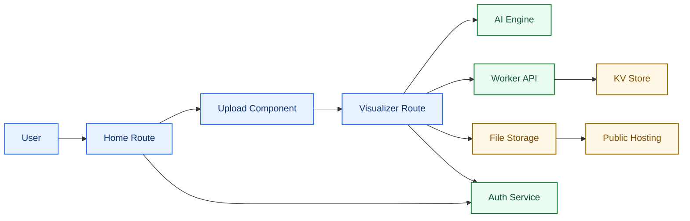
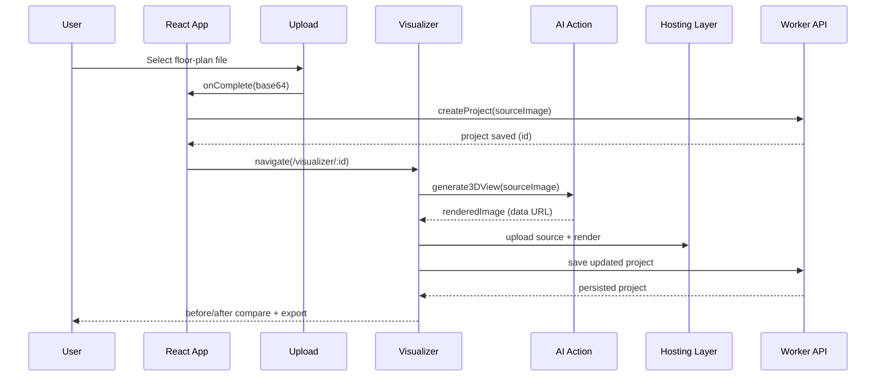
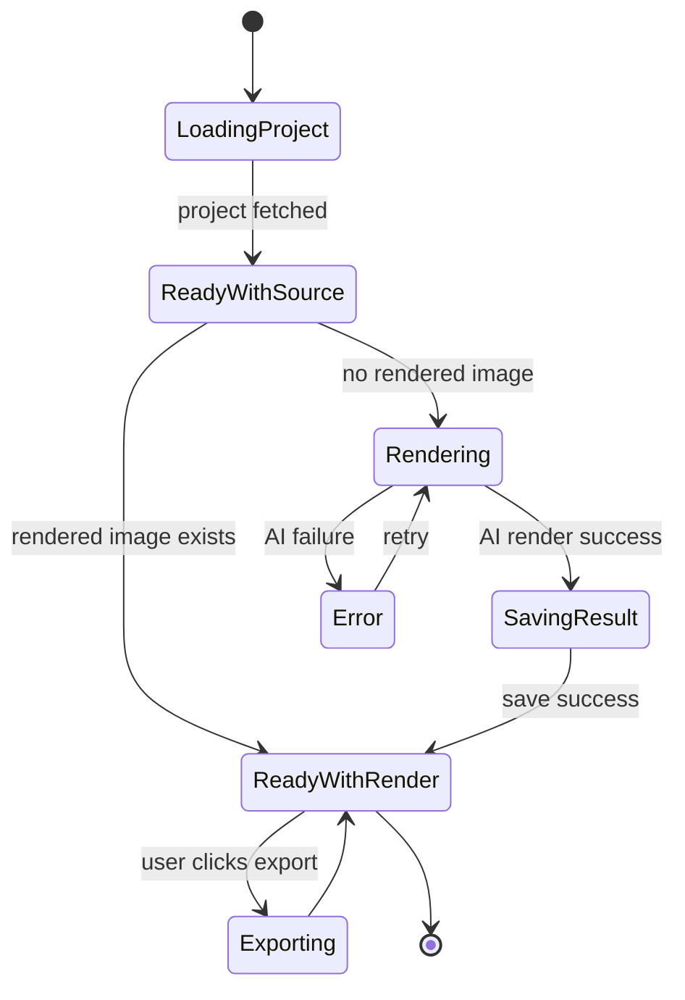
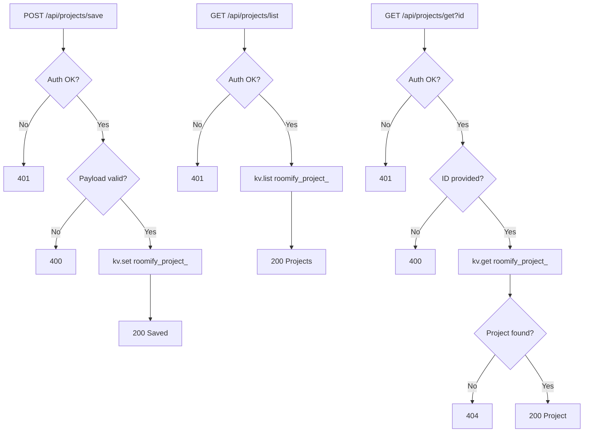

# 🏗️Roomify

Roomify is an AI-powered interior visualization web app that converts 2D floor plans into rendered 3D-style top-down images.

## What This Project Does

- Upload a floor-plan image (JPG/PNG).
- Generate a rendered design view using Puter AI image generation.
- Compare before/after with an interactive slider.
- Save and load projects through a Puter Worker API.
- Host project images on Puter Hosting.
- Authenticate users with Puter Auth.

## Tech Stack

### Frontend

- React 19
- React Router 7
- TypeScript
- Vite
- Lucide React
- react-compare-slider

### Backend / Services

- Puter SDK (`@heyputer/puter.js`)
- Puter Auth (sign in/out, current user)
- Puter Workers (project API)
- Puter KV (project metadata)
- Puter FS (uploaded image storage)
- Puter Hosting (public image URLs)
- Puter AI (`txt2img` with `gemini-2.5-flash-image-preview`)

## Repository Highlights

- `app/routes/home.tsx`: Landing, upload entry, projects list.
- `app/routes/visualizer.$id.tsx`: Render view, compare slider, export action.
- `components/Upload.tsx`: Upload UX and FileReader flow.
- `lib/ai.action.ts`: AI generation + URL-to-data URL conversion.
- `lib/puter.action.ts`: Auth and project CRUD calls through worker endpoints.
- `lib/puter.hosting.ts`: Hosting setup and image upload logic.
- `lib/puter.worker.js`: Worker endpoints for save/list/get project operations.

## Environment Setup

Create a `.env` file:

```bash
VITE_PUTER_WORKER_URL=<your_worker_base_url>
```

Install and run:

```bash
npm install
npm run dev
```

Build and typecheck:

```bash
npm run typecheck
npm run build
npm run start
```

## API Endpoints (Worker)

Configured in `lib/puter.worker.js`:

- `POST /api/projects/save`
- `GET /api/projects/list`
- `GET /api/projects/get?id=<projectId>`

## Project Flow (High Level)

1. User signs in with Puter Auth.
2. User uploads a floor plan in `Upload`.
3. App creates project metadata and navigates to visualizer route.
4. Visualizer calls AI generation from `lib/ai.action.ts`.
5. Output images are uploaded/served through Puter Hosting.
6. Project state is persisted via Worker + KV.
7. User compares, exports, and revisits saved projects.

## AI-Generated Interactive Diagrams

### 1) System Architecture Map



### 2) End-to-End Render Sequence



### 3) Visualizer State Machine



### 4) Worker Data Lifecycle



## Notes

- AI generation prompt is defined in `lib/constants.ts` (`ROOMIFY_RENDER_PROMPT`).
- Hosted URL suffix validation uses `.puter.site`.
- App currently relies on Puter services for auth, storage, and inference.
